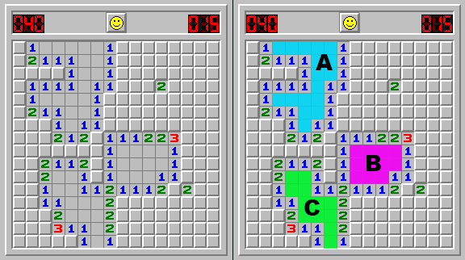

# Exercise - Mine Sweeper (Part 2)

### (recommend to work in pairs)

You have the task of creating the classic [mine sweeper](https://itunes.apple.com/us/app/minesweeper-deluxe/id657011614?mt=12) game in your terminal.

# Commit 0 - Research

- [Color Example](examples/colorized_example.rb)
- [`STDIN.getch` Example](examples/io_getch_example.rb)
- Review Recursion

# App Continued

## Steps for each Commit

### A. Psuedocode

This is a large project and it is very beneficial to break it down into smaller sections. It is up to you how detailed this needs to be for each commit.

### B. Code

Create your solution for the current section only.

### C. Refactoring

As you complete a large section of code or a single method and get it to run correctly, you should periodically take a moment to refactor before moving forward. As you app gets bigger it will become harder to move forward unless your code is clean.

<br>

## Commit 1 - Color

Instead of typing in coordinates each time try highlighting a target quare with color in your terminal. then use the input of `up`, `down`, `left`, `right` to move your selection around the grid and target a coordinate.

Use this [color example](resources/colorized_example.rb)

<br>

## Commit 2 - Single Character Input
Instead of typeing in a full word as a command then hitting enter to execute. use the tool below.

I recommend the following keys for movement and action, however you can use any keys that you like.

```
'a' #=> left move
's' #=> down move
'w' #=> up move
'd' #=> right move

'j' #=> check one square
'k' #=> check surrounding squares
'l' #=> mark as bomb
';' #=> mark as questionable

'0' #=> to quit
```

<br>

## Commit 3 - Clear Empty Blob

There are pockets of squares (blob) that don't touch a single bomb. If a user uncovers a square with no bombs touching it, your app will automatically uncover the surrounding squares until you see the squares that are one away from a bomb and show a number.

You must scan the map for collections of squares that do not touch bombs and the squares that are above, below, left, or right - forming blobs or clumps.



##### Guiding Questions

- As you are scanning the blob(s), you should mark the squares that you've already checked. Does this require another attribute on the square or do you have enough information already?
- Do you scan/identify the blobs when you click on a "blob square" or is this part of the intialization of a game, marked and waiting for someone to uncover it later.
- Is this easier to do with iteration or recursion?

<br>

## Commit 4 - Make the grid dynamic

At the start of your program add a prompt that allows you to change the number of rows and columns in your grid. You can just ask "how many rows?" and "how many columns?" or you can have levels easy equals 5 x 8, hard equals 20 x 40, etc. You can also change the number of bombs on the grid.

<br>

## Bonus 1 - Dive into Blobs

### Resarch Blobs

In `Mine Sweeper` app we are taking some liberties with the term `BLOB`. The term has different definitions based on where you find it in the world of code. But for our purposes, we are referring to it similar to a Pixel Blob.

[Pixel Blob](http://what-when-how.com/introduction-to-video-and-image-processing/blob-analysis-introduction-to-video-and-image-processing-part-1/)

## Bonus 2 - Game Framework

If you want to dive deeper into making video games in ruby that do have a framerate of 60 frames per second. Take a look at [Gosu](https://www.libgosu.org/ruby.html), a video game framework for ruby. I also recommend the book, [Learn Game Programming with Ruby by Mark Sobkowicz](https://pragprog.com/book/msgpkids/learn-game-programming-with-ruby)